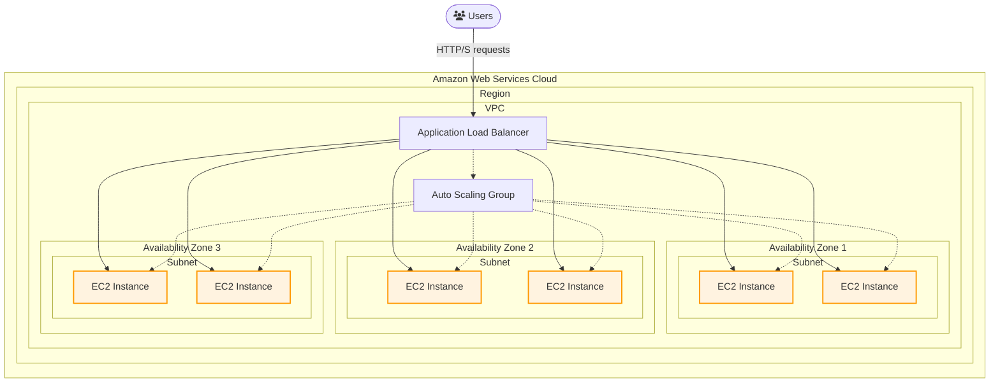

# AWS Scalable Web Application - Solution Architecture

## Architecture Overview

This diagram closely matches the AWS reference style, with a single VPC rectangle, subnets inside, and EC2 instances inside subnets.

---

- The VPC contains all subnets and resources.
- Each subnet is inside an Availability Zone.
- The Application Load Balancer is inside the VPC and connects to all EC2 instances.
- The Auto Scaling Group covers all EC2 instances across subnets.
- Security groups are shown as a style overlay on EC2 instances.
- Users access the application via the ALB.

## Component Details

### 1. **VPC Architecture**
- **CIDR**: 10.0.0.0/16
- **Public Subnets**: 10.0.1.0/24, 10.0.2.0/24 (us-east-1a, us-east-1b)
- **Private Subnets**: 10.0.11.0/24, 10.0.12.0/24 (us-east-1a, us-east-1b)
- **Internet Gateway**: Provides internet access to public subnets
- **NAT Gateway**: Provides outbound internet access to private subnets

### 2. **Application Load Balancer (ALB)**
- **Location**: Public subnets (for internet accessibility)
- **Type**: Application Load Balancer
- **Protocol**: HTTP (Port 80)
- **Health Check**: `/health` endpoint
- **Target Group**: EC2 instances on port 5000
- **Security Group**: Allows HTTP/HTTPS traffic from internet

### 3. **Auto Scaling Group (ASG)**
- **Location**: Private subnets (for security)
- **Instance Type**: t3.micro
- **AMI**: Amazon Linux 2
- **Min Size**: 2 instances
- **Max Size**: 4 instances
- **Desired Capacity**: 2 instances
- **Scaling Policies**: CPU-based scaling (80% threshold)

### 4. **EC2 Instances**
- **Location**: Private subnets (no direct internet access)
- **Operating System**: Amazon Linux 2
- **Application**: Python Flask web application
- **Port**: 5000
- **User Data**: Automated setup script
- **IAM Role**: CloudWatch, S3, and SSM permissions

### 5. **Security Groups**
- **ALB SG**: Inbound HTTP/HTTPS, outbound all (in public subnets)
- **EC2 SG**: Inbound from ALB on port 5000, SSH on port 22 (in private subnets)

### 6. **Monitoring & Alerting**
- **CloudWatch**: Metrics, logs, and dashboards (AWS managed service)
- **SNS**: Email notifications for alarms (AWS managed service)
- **Alarms**: CPU, memory, ALB errors, response time

### 7. **IAM Roles & Policies**
- **EC2 Role**: CloudWatch, S3, and SSM permissions
- **Instance Profile**: Attached to EC2 instances

## Traffic Flow

1. **Inbound Traffic**: Internet → Internet Gateway → Public Subnets → ALB → Private Subnets → EC2 instances
2. **Health Checks**: ALB → `/health` endpoint on EC2 instances
3. **Outbound Traffic**: EC2 instances → Private Subnets → NAT Gateway → Internet Gateway → Internet
4. **Monitoring**: EC2 instances → CloudWatch → SNS notifications

## Scalability Features

- **Horizontal Scaling**: Auto Scaling Group with CPU-based policies
- **Load Distribution**: ALB distributes traffic across healthy instances
- **High Availability**: Multi-AZ deployment across 2 availability zones
- **Fault Tolerance**: Health checks ensure only healthy instances receive traffic

## Security Features

- **Network Security**: Private subnets for EC2 instances (no direct internet access)
- **Security Groups**: Restrictive firewall rules
- **IAM Roles**: Least privilege access for EC2 instances
- **VPC Isolation**: Complete network isolation
- **NAT Gateway**: Controlled outbound internet access for private instances

## Cost Optimization

- **Instance Type**: t3.micro (burstable performance)
- **Auto Scaling**: Scale down during low traffic
- **Reserved Instances**: Can be applied for cost savings
- **Monitoring**: Proactive cost monitoring with CloudWatch 