# AWS Scalable Web Application - Solution Architecture

## Architecture Overview

This diagram illustrates the complete AWS infrastructure for the scalable web application with ALB and Auto Scaling.

```mermaid
graph TB
    %% Internet
    Internet[🌐 Internet]
    
    %% Application Load Balancer
    ALB[🔗 Application Load Balancer<br/>aws-scalable-webapp-production-alb]
    
    %% Auto Scaling Group
    subgraph ASG[🔄 Auto Scaling Group<br/>aws-scalable-webapp-production-asg]
        EC2_1[🖥️ EC2 Instance 1<br/>t3.micro]
        EC2_2[🖥️ EC2 Instance 2<br/>t3.micro]
        EC2_N[🖥️ EC2 Instance N<br/>t3.micro]
    end
    
    %% VPC Components
    subgraph VPC[🏢 VPC: 10.0.0.0/16]
        subgraph PublicSubnets[🌍 Public Subnets]
            PublicSubnet1[📡 Public Subnet 1<br/>10.0.1.0/24<br/>us-east-1a]
            PublicSubnet2[📡 Public Subnet 2<br/>10.0.2.0/24<br/>us-east-1b]
        end
        
        subgraph PrivateSubnets[🔒 Private Subnets]
            PrivateSubnet1[🔐 Private Subnet 1<br/>10.0.11.0/24<br/>us-east-1a]
            PrivateSubnet2[🔐 Private Subnet 2<br/>10.0.12.0/24<br/>us-east-1b]
        end
        
        %% Network Components
        IGW[🌐 Internet Gateway]
        NAT[🌐 NAT Gateway]
        EIP[💳 Elastic IP]
        
        %% Security Groups
        ALB_SG[🛡️ ALB Security Group<br/>Ports: 80, 443]
        EC2_SG[🛡️ EC2 Security Group<br/>Ports: 5000, 22]
    end
    
    %% AWS Services
    CloudWatch[📊 CloudWatch<br/>Monitoring & Logging]
    SNS[📧 SNS Topic<br/>Alerts & Notifications]
    IAM[🔑 IAM Role<br/>EC2 Permissions]
    
    %% Application
    FlaskApp[🐍 Flask Web Application<br/>Port 5000]
    
    %% Connections
    Internet --> ALB
    ALB --> ALB_SG
    ALB_SG --> PublicSubnet1
    ALB_SG --> PublicSubnet2
    
    EC2_1 --> EC2_SG
    EC2_2 --> EC2_SG
    EC2_N --> EC2_SG
    EC2_SG --> PrivateSubnet1
    EC2_SG --> PrivateSubnet2
    
    ALB --> EC2_1
    ALB --> EC2_2
    ALB --> EC2_N
    
    EC2_1 --> FlaskApp
    EC2_2 --> FlaskApp
    EC2_N --> FlaskApp
    
    EC2_1 --> IAM
    EC2_2 --> IAM
    EC2_N --> IAM
    
    EC2_1 --> CloudWatch
    EC2_2 --> CloudWatch
    EC2_N --> CloudWatch
    
    CloudWatch --> SNS
    
    PrivateSubnet1 --> NAT
    PrivateSubnet2 --> NAT
    NAT --> EIP
    EIP --> IGW
    IGW --> Internet
    
    PublicSubnet1 --> IGW
    PublicSubnet2 --> IGW
    
    %% Styling
    classDef awsService fill:#FF9900,stroke:#232F3E,stroke-width:2px,color:#fff
    classDef network fill:#3B48CC,stroke:#232F3E,stroke-width:2px,color:#fff
    classDef security fill:#D13212,stroke:#232F3E,stroke-width:2px,color:#fff
    classDef compute fill:#009900,stroke:#232F3E,stroke-width:2px,color:#fff
    classDef monitoring fill:#FF6B6B,stroke:#232F3E,stroke-width:2px,color:#fff
    
    class ALB,ASG,CloudWatch,SNS,IAM awsService
    class VPC,PublicSubnets,PrivateSubnets,IGW,NAT,EIP network
    class ALB_SG,EC2_SG security
    class EC2_1,EC2_2,EC2_N,FlaskApp compute
    class CloudWatch,SNS monitoring
```

## Component Details

### 1. **Application Load Balancer (ALB)**
- **Type**: Application Load Balancer
- **Protocol**: HTTP (Port 80)
- **Health Check**: `/health` endpoint
- **Target Group**: EC2 instances on port 5000
- **Security Group**: Allows HTTP/HTTPS traffic from internet

### 2. **Auto Scaling Group (ASG)**
- **Instance Type**: t3.micro
- **AMI**: Amazon Linux 2
- **Min Size**: 2 instances
- **Max Size**: 4 instances
- **Desired Capacity**: 2 instances
- **Scaling Policies**: CPU-based scaling (80% threshold)

### 3. **EC2 Instances**
- **Operating System**: Amazon Linux 2
- **Application**: Python Flask web application
- **Port**: 5000
- **User Data**: Automated setup script
- **IAM Role**: CloudWatch, S3, and SSM permissions

### 4. **VPC Architecture**
- **CIDR**: 10.0.0.0/16
- **Public Subnets**: 10.0.1.0/24, 10.0.2.0/24
- **Private Subnets**: 10.0.11.0/24, 10.0.12.0/24
- **Availability Zones**: us-east-1a, us-east-1b

### 5. **Security Groups**
- **ALB SG**: Inbound HTTP/HTTPS, outbound all
- **EC2 SG**: Inbound from ALB on port 5000, SSH on port 22

### 6. **Monitoring & Alerting**
- **CloudWatch**: Metrics, logs, and dashboards
- **SNS**: Email notifications for alarms
- **Alarms**: CPU, memory, ALB errors, response time

### 7. **IAM Roles & Policies**
- **EC2 Role**: CloudWatch, S3, and SSM permissions
- **Instance Profile**: Attached to EC2 instances

## Traffic Flow

1. **Inbound Traffic**: Internet → ALB → EC2 instances
2. **Health Checks**: ALB → `/health` endpoint on EC2 instances
3. **Outbound Traffic**: EC2 instances → NAT Gateway → Internet
4. **Monitoring**: EC2 instances → CloudWatch → SNS notifications

## Scalability Features

- **Horizontal Scaling**: Auto Scaling Group with CPU-based policies
- **Load Distribution**: ALB distributes traffic across healthy instances
- **High Availability**: Multi-AZ deployment across 2 availability zones
- **Fault Tolerance**: Health checks ensure only healthy instances receive traffic

## Security Features

- **Network Security**: Private subnets for EC2 instances
- **Security Groups**: Restrictive firewall rules
- **IAM Roles**: Least privilege access for EC2 instances
- **VPC Isolation**: Complete network isolation

## Cost Optimization

- **Instance Type**: t3.micro (burstable performance)
- **Auto Scaling**: Scale down during low traffic
- **Reserved Instances**: Can be applied for cost savings
- **Monitoring**: Proactive cost monitoring with CloudWatch 